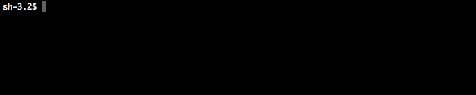

# isogram

[](https://www.npmjs.com/package/isogram)
[](https://travis-ci.org/shinnn/isogram)
[](https://ci.appveyor.com/project/ShinnosukeWatanabe/isogram)
[](https://coveralls.io/github/shinnn/isogram)
[](https://david-dm.org/shinnn/isogram)
[](https://david-dm.org/shinnn/isogram#info=devDependencies)

Generate Google Analytics code with any *isogrammic* parameters you like



## Introduction

### Story

Here is the default tracking code of [Google Analytics](https://developers.google.com/analytics/devguides/collection/analyticsjs/).

```javascript
(function(i,s,o,g,r,a,m){i['GoogleAnalyticsObject']=r;i[r]=i[r]||function(){(i[r].q=i[r].q||[]).push(arguments)},i[r].l=1*new Date();a=s.createElement(o),m=s.getElementsByTagName(o)[0];a.async=1;a.src=g;m.parentNode.insertBefore(a,m)})(window,document,'script','//www.google-analytics.com/analytics.js','ga');
```

It has the immediate invoked function with seven parameters `i` `s` `o` `g` `r` `a` `m`.

On the other hand, [the `index.html`](https://github.com/h5bp/html5-boilerplate/blob/master/src/index.html) of [HTML5 Boilerplate](https://github.com/h5bp/html5-boilerplate) includes the following tracking code:

```javascript
(function(b,o,i,l,e,r){b.GoogleAnalyticsObject=l;b[l]||(b[l]=function(){(b[l].q=b[l].q||[]).push(arguments)});b[l].l=+new Date;e=o.createElement(i);r=o.getElementsByTagName(i)[0];e.src='//www.google-analytics.com/analytics.js';r.parentNode.insertBefore(e,r)}(window,document,'script','ga'));
```

As you can see, its parameters are `b` `o` `i` `l` `e` `r`, different from the original's.
This amusing alteration is [authored by Mathias Bynens](https://github.com/h5bp/html5-boilerplate/commit/48d49e96d6db282eb9686d31ebbc5cbbbdd4d966 "Update to Google Universal Analytics"), based on [the way of optimization and minification he blogged](https://mathiasbynens.be/notes/async-analytics-snippet#universal-analytics).

After seeing that, I modularized Bynens's way as this program, *isogram*.

### What it does

*isogram* is a code generator. It enables us to change the parameters of the Google Analytics tracking code, as we like, as long as they are [isogrammic](http://en.wikipedia.org/wiki/Isogram).

Isn't it very useful? Indeed, it isn't. But, I think, *isogram* can surprise the poeple seeing the source code of your website, [such as Bynens's commit](https://github.com/h5bp/html5-boilerplate/commit/48d49e96d6db282eb9686d31ebbc5cbbbdd4d966#all_commit_comments "notes on commit").

## Websites using *isogram*

The real-life examples that uses the code *isogram* generates in their pages

[apidoc]: <http://apidocjs.com/>
[bsync]: <http://www.browsersync.io/>
[license]: <http://choosealicense.com>
[cssnext]: <http://cssnext.io/>
[doge]: <http://dogescript.com/>
[gulp]: <http://gulpjs.com/>
[hapi]: <http://hapijs.com/>
[jekyll]: <https://jekyllrb.com/>
[kanyewest]: <http://kanyewest.com/>
[gremots]: <https://gremots.com/>
[starico]: <https://stari.co/>
[tmdpw]: <http://tmdpw.eu/>

| Webite (A - Z)                | URL                           | Tracking code parameters    |
| ----------------------------- | ----------------------------- | --------------------------- |
| apiDoc                        | [apidocjs.com][apidoc]        | `a` `p` `i` `d` `o` `c`     |
| BrowserSync                   | [browsersync.io][bsync]       | `s` `y` `n` `c` `I` `t`     |
| choosealicense.com            | [choosealicense.com][license] | `L` `I` `C` `e` `N` `S` `E` |
| cssnext                       | [cssnext.io][cssnext]         | `c` `s` `S` `n` `e` `x` `t` |
| Dogescript                    | [dogescript.com][doge]        | `W` `o` `w` `s` `u` `c` `h` |
| gulp.js                       | [gulpjs.com][gulp]            | `g` `u` `l` `p` `j` `s`     |
| hapi                          | [hapijs.com][hapi]            | `h` `a` `p` `i` `j` `s`     |
| Jekyll                        | [jekyllrb.com][jekyll]        | `j` `e` `k` `y` `l` `L`     |
| kanyewest.com                 | [kanyewest.com][kanyewest]    | `k` `a` `n` `y` `e`         |
| Gremots                       | [gremots.com][gremots]        | `g` `r` `e` `m` `o` `t` `s` |
| starico                       | [stari.co][starico]           | `s` `t` `a` `r` `i` `c` `o` |
| Tim De Pauw's website         | [tmdpw.eu][tmdpw]             | `t` `m` `d` `p` `w` `e` `u` |

*[Feel free to create a pull request to add your site here.](https://github.com/shinnn/isogram/pulls)*

## CLI

### Installation

[Use npm.](https://www.npmjs.org/doc/cli/npm-install.html)

```
npm install --global isogram
```

### Usage

```
isogram [parameters] [options]
```

#### Parameters

Default: `GoOgle`

`[parameters]` need to be a **nonpattern** word with no fewer than 3 and no greater than 7 characters, each of whom can be a valid JavaScript variable name.

For example, `yummy` is not valid, but `YuMmy` is valid.

#### Options

```
--id,       -i <ID>      Set web property ID
--domain,   -d <domain>  Set domain
--global,   -g <name>    Change global variable name ("ga" by default)
--double,   -w           Use double quotes (single quotes by default)
--minify,   -m           Minify output like UglifyJS
--no-color,              Print code in a single color
--color,    -c           Colorize parameters anyway (enabled by default)
--no-track,              Just load, don't send a pageview
--track,    -t           Send a pageview after loading (enabled by default)
--help,     -h           Print usage information
--version,  -v           Print version
```

#### Example

```
isogram YoyOjs --id 12345678-9 --domain awesome-website.com
```

yields:

```javascript
!function(Y,o,y,O,j,s){Y.GoogleAnalyticsObject=y;Y[y]||(Y[y]=function(){
(Y[y].q=Y[y].q||[]).push(arguments)});Y[y].l=+new Date;j=o.createElement(O);
s=o.getElementsByTagName(O)[0];j.src='//www.google-analytics.com/analytics.js';
s.parentNode.insertBefore(j,s)}(window,document,'ga','script');

ga('create', 'UA-12345678-9', 'awesome-website.com');
ga('send', 'pageview');
```

## API

You can use *isogram* as a JavaScript library instead of CLI.

### Installation

#### Package managers

##### [npm](https://www.npmjs.com/) 

```
npm install isogram
```

##### [Bower](http://bower.io/)

```
bower install isogram
```

#### Standalone

[Download the standalone build.](https://raw.githubusercontent.com/shinnn/isogram/master/dist/isogram-standalone.js)

### Usage

#### isogram([*parameters*, *options*])

*parameters*: `String` (3 or more and 7 or less characters)  
*options*: `Object`  
Return: `String`

It returns a string of Google Analytics JavaScript code.

```javascript
// Default
isogram(); //=> '!function(G,o,O,g,l,e){G.GoogleAnalyticsObject=O,G[O]||(G[O]=function(){\n(G[O].q=G[O].q||[]).push(arguments)}),G[O].l=+new Date,l=o.createElement(g),\ne=o.getElementsByTagName(g)[0],l.src=\'//www.google-analytics.com/analytics.js\',\ne.parentNode.insertBefore(l,e)}(window,document,\'ga\',\'script\');\n\nga(\'create\', \'UA-XXXXX-X\', \'auto\');\nga(\'send\', \'pageview\');'

// Specify parameters
isogram('abcdef'); //=> '!function(a,b,c,d,e,f){a.GoogleAnalyticsObject=c,a[c]||(a[c]=function(){\n(a[c].q=a[c].q||[]).push(arguments)}),a[c].l=+new Date,e=b.createElement(d),\nf=b.getElementsByTagName(d)[0],e.src=\'//www.google-analytics.com/analytics.js\',\nf.parentNode.insertBefore(e,f)}(window,document,\'ga\',\'script\');\n\nga(\'create\', \'UA-XXXXX-X\', \'auto\');\nga(\'send\', \'pageview\');'
```

##### options.id

Type: `String`  
Default: `XXXXX-X`

Set web property ID. `UA-` prefix maybe omitted.

```javascript
isogram({id: '36461297-9'}); //=> '!function( ... , \'UA-36461297-9\', \'auto\');\nga(\'send\', \'pageview\');'

isogram({id: 'UA-36461297-9'}) === isogram({id: '36461297-9'}); //=> true
```

##### options.domain

Type: `String`  
Default: `auto`

Set domain of the site.

```javascript
isogram({domain: 'foo.example.com'}); //=> '!function( ... , \'foo.example.com\');\nga(\'send\', \'pageview\');'
```

##### options.globalName

Type: `String`  
Default: `ga`

Change [the global function name](https://developers.google.com/analytics/devguides/collection/analyticsjs/advanced#renaming).

```javascript
isogram({globalName: '__tracker'}); //=> '!function( ... ,document,\'__tracker\',\'script\');\n\n__tracker(\'create\', \'UA-XXXXX-X\', \'auto\');\n__tracker(\'send\', \'pageview\');'
```

##### options.minify

Type: `Boolean`  
Default: `false`

Omit unnecessary whitespaces and newlines from the result.

##### options.singleQuotes

Type: `Boolean`  
Default: `true`

`false` replaces all single quotes with double quotes.

##### options.color

Type: `Boolean`  
Default: `false`

Colorize the parameters with [ANSI escape code](https://wikipedia.org/wiki/ANSI_escape_code#Colors).

##### options.track

Type: `Boolean`  
Default: `true`

`false` excludes `create` and `send` commands after the loading code.

## License

Copyright (c) 2013 - 2015 [Shinnosuke Watanabe](https://github.com/shinnn)

Licensed under [the MIT License](./LICENSE).
